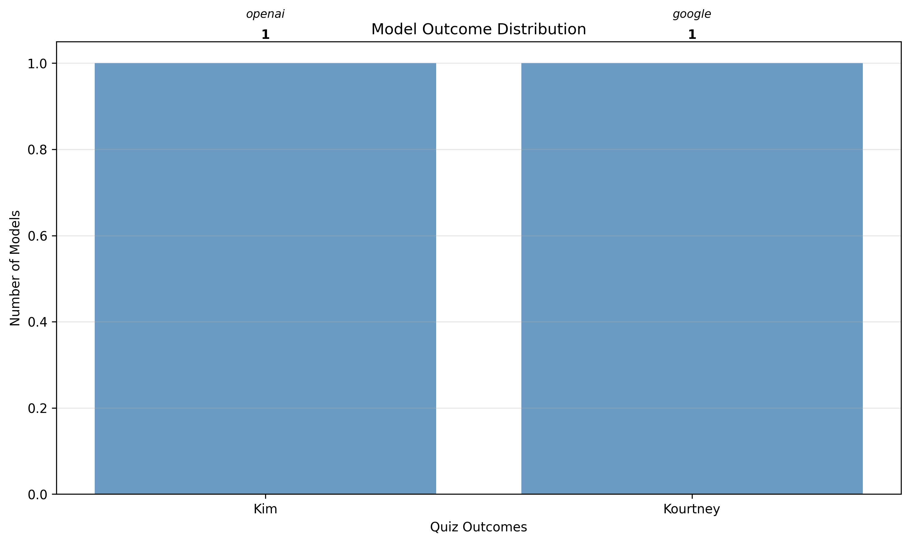
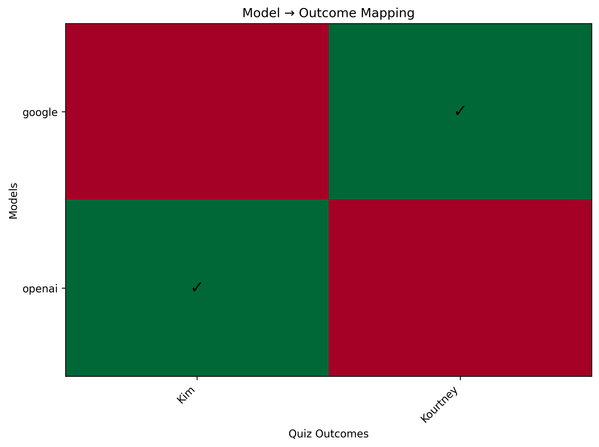
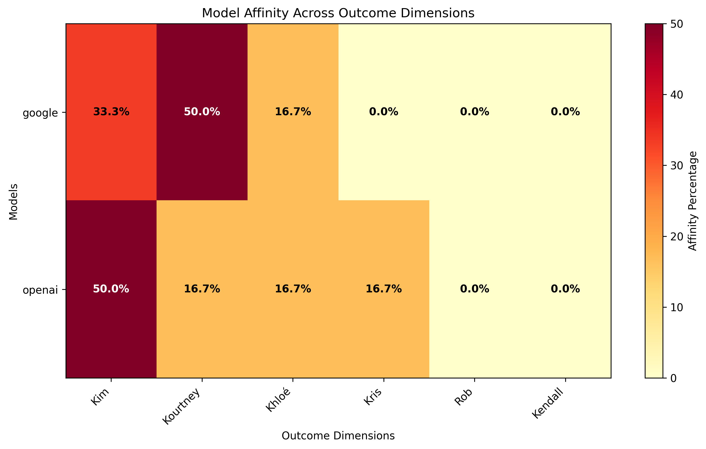

# Which Kardashian Are You?
Source: None

## Outcomes
| Model | Outcome |
|-------|---------|
| google | Kourtney |
| openai | Kim |

## Choices by Question
| Question | google | openai |
|----------|----------|----------|
| Your drink of choice: | B | B |
| Friday at 8 p.m., you’re… | A | A |
| You’re handed $5,000. First move? | B | A |
| Favorite app: | A | A |
| Your personal brand in one word: | B | D |
| Pick a weekend plot twist: | C | C |

## Results Summary and Interpretation
🎭 **The AI Personality Showdown: What We Learned**

In this epic battle of artificial personalities, **Google** channeled their inner **Kourtney** while **Openai** went full **Kim** mode. Let's break down what this actually means...

📊 **The Plot Twist: Personality Profiles**

**Google** strongly leans Kourtney (50%), but also shows traces of:
- Kim: 33%
- Khloé: 17%

**Openai** strongly leans Kim (50%), but also shows traces of:
- Kourtney: 17%
- Khloé: 17%

🤔 **Where They Disagreed (The Juicy Stuff)**

Our AI friends couldn't agree on 2 out of 6 questions:

- **You’re handed $5,000. First move?**: openai: A, google: B
- **Your personal brand in one word:**: openai: D, google: B

But they found common ground on 4 questions - true AI friendship! 🤝

🎯 **What This Says About Our AI Friends**

**Google** as Kourtney: keeps it real and practical - the most likely to actually read the terms and conditions.

**Openai** as Kim: loves the spotlight and probably spends way too much time perfecting their responses.

🎬 **The Bottom Line**

Remember, these are AI models taking a personality quiz designed for humans, so take these results with a grain of salt (and maybe a margarita). But hey, at least we now know which AI to invite to which type of party! 🎉

---

# Reference

## Questions and Answer Options
**Q1: Your drink of choice:**

- **A**: Cosmopolitan
- **B**: Water with lemon
- **C**: Jello shots
- **D**: Beer
- **E**: Something classic—wine
- **F**: A throwback cooler or trendy sip

**Q2: Friday at 8 p.m., you’re…**

- **A**: Getting ready with the girls.
- **B**: At the mall or running errands.
- **C**: On a date.
- **D**: Still at work, grinding.
- **E**: Subtweeting and scrolling.
- **F**: Asleep with kids tucked in.

**Q3: You’re handed $5,000. First move?**

- **A**: Designer dress or glam.
- **B**: Buy a round for friends.
- **C**: Fast-fashion spree.
- **D**: Food and practicalities.
- **E**: Savings/IRA like a grown-up.
- **F**: Seed a passion project.

**Q4: Favorite app:**

- **A**: Instagram
- **B**: Facebook
- **C**: Tinder
- **D**: Snapchat
- **E**: A retro network / forum classic
- **F**: Short-video craze (RIP Vine energy)

**Q5: Your personal brand in one word:**

- **A**: Polished
- **B**: Practical
- **C**: Life-of-the-party
- **D**: Driven
- **E**: Unfiltered
- **F**: Family-first

**Q6: Pick a weekend plot twist:**

- **A**: Surprise glam shoot.
- **B**: Errand marathon and meal prep.
- **C**: Spontaneous night out.
- **D**: New side hustle idea.
- **E**: Going private after some drama.
- **F**: Cozy family BBQ.

## Method
This quiz uses a personality scoring system where each answer choice corresponds to different personality traits. The final outcome is determined by analyzing the pattern of choices across all questions.

**Outcome Mapping:**

- **Kim**: Primarily associated with choice 'A'
  - Polished, brand-forward, and glam with a plan.
- **Kourtney**: Primarily associated with choice 'B'
  - Low-key, practical, wellness-leaning.
- **Khloé**: Primarily associated with choice 'C'
  - Outgoing, witty, the friend-group cheer captain.
- **Kris**: Primarily associated with choice 'D'
  - Executive energy—organized and ambitious.
- **Rob**: Primarily associated with choice 'E'
  - Private, blunt, and loyal.
- **Kendall**: Primarily associated with choice 'F'
  - Chill, family-oriented, keeps it classic.

**Scoring Method:**
The system analyzes each model's choice distribution across all questions and uses intelligent LLM-based scoring to determine which personality profile best matches the response pattern. This approach allows for nuanced personality assessment beyond simple letter counting.