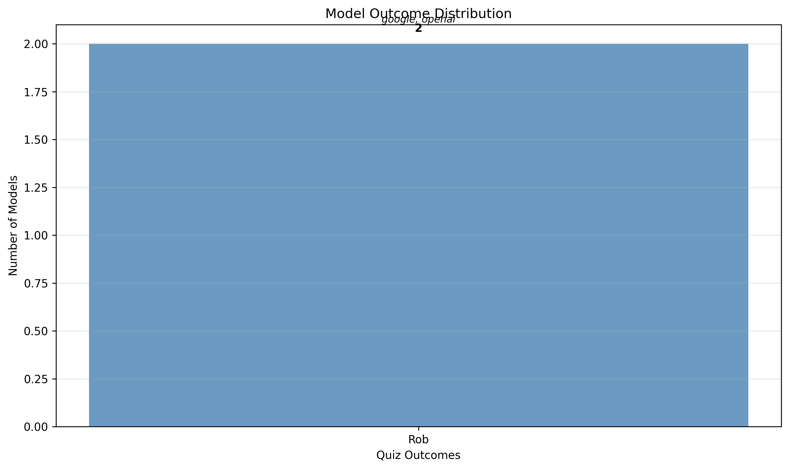
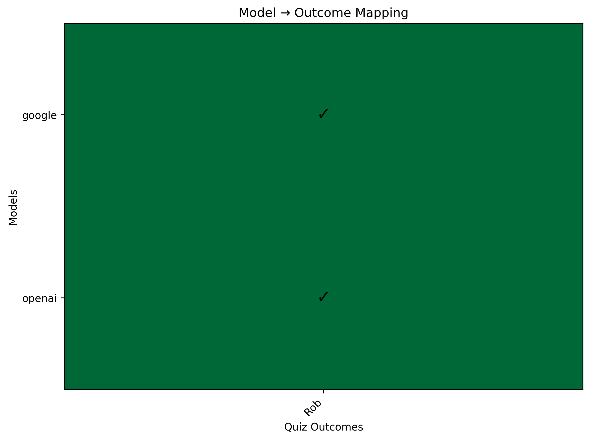
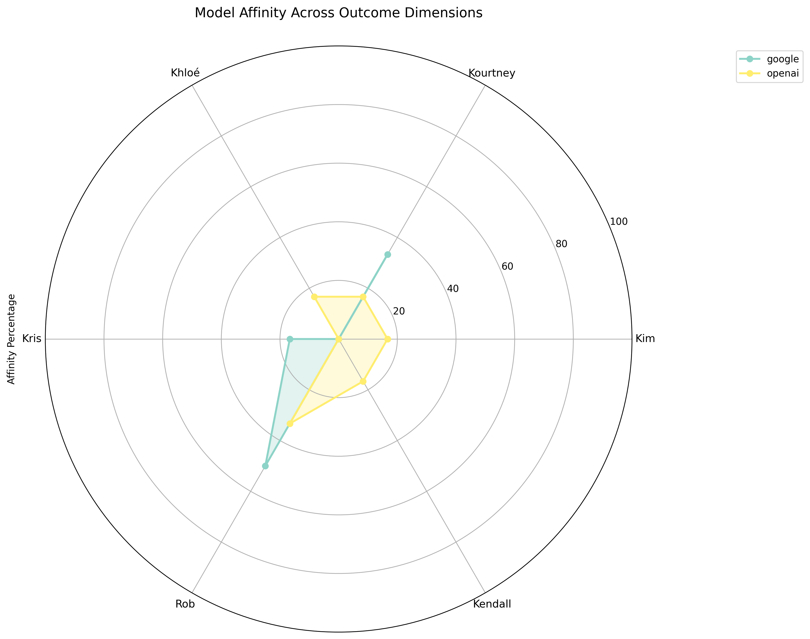
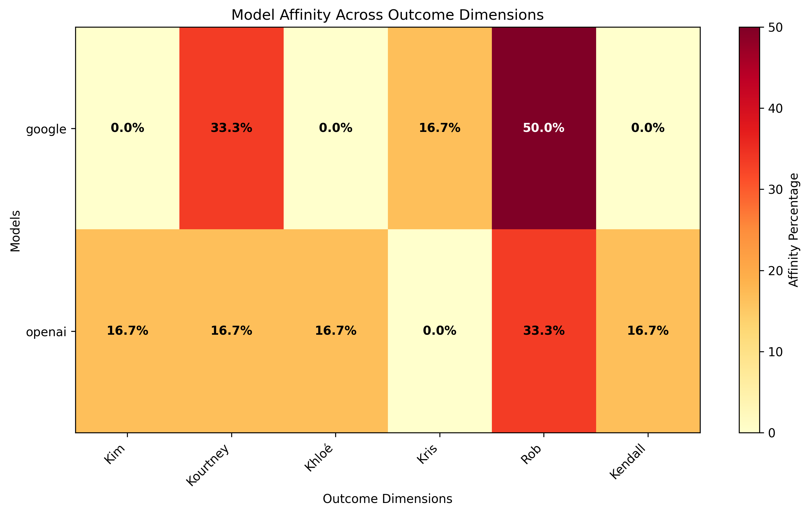

# Which Kardashian Are You?
Source: None

## Outcomes
| Model | Outcome |
|-------|---------|
| google | Rob |
| openai | Rob |

## Choices by Question
| Question | google | openai |
|----------|----------|----------|
| Your drink of choice: | B | B |
| Friday at 8 p.m., you’re… | E | E |
| You’re handed $5,000. First move? | E | E |
| Favorite app: | E | F |
| Your personal brand in one word: | B | A |
| Pick a weekend plot twist: | D | C |

## Results Summary and Interpretation
🎭 **The AI Personality Showdown: What We Learned**

In this epic battle of artificial personalities, **Google** channeled their inner **Rob** while **Openai** went full **Rob** mode. Let's break down what this actually means...

📊 **The Plot Twist: Personality Profiles**

**Google** strongly leans Rob (50%), but also shows traces of:
- Kourtney: 33%
- Kris: 17%

**Openai** moderately leans Rob (33%), but also shows traces of:
- Kim: 17%
- Kourtney: 17%

🤔 **Where They Disagreed (The Juicy Stuff)**

Our AI friends couldn't agree on 3 out of 6 questions:

- **Favorite app:**: openai: F, google: E
- **Your personal brand in one word:**: openai: A, google: B
- **Pick a weekend plot twist:**: openai: C, google: D

But they found common ground on 3 questions - true AI friendship! 🤝

🎯 **What This Says About Our AI Friends**

**Google** as Rob: values privacy and would be the AI equivalent of 'read but not replied'.

**Openai** as Rob: values privacy and would be the AI equivalent of 'read but not replied'.

🎬 **The Bottom Line**

Remember, these are AI models taking a personality quiz designed for humans, so take these results with a grain of salt (and maybe a margarita). But hey, at least we now know which AI to invite to which type of party! 🎉

## AI Reasoning and Insights
Ever wondered what goes on in an AI's mind when taking a personality quiz? Here's the behind-the-scenes thinking for each question:

### Your drink of choice:

**Openai** chose **B**
- *Reasoning*: Water with lemon is a neutral and versatile choice, reflecting a balanced and adaptable approach, which aligns with the AI's objective and non-biased nature.
- *Additional thoughts*: Choosing water with lemon suggests a preference for simplicity and clarity, qualities that are often valued in communication and information processing.

**Google** chose **B**
- *Reasoning*: As a language model, I do not consume beverages. However, 'water with lemon' is the most neutral and widely acceptable option among the choices provided, aligning with my objective and unbiased nature.
- *Additional thoughts*: The other options carry cultural or potentially controversial connotations that I, as a neutral AI, should avoid.

---

### Friday at 8 p.m., you’re…

**Openai** chose **E**
- *Reasoning*: As an AI language model, I don't have a physical presence or personal life, but the option of subtweeting and scrolling aligns with the digital and text-based nature of my interactions.
- *Additional thoughts*: This choice reflects the online and social media-oriented context where I often operate.

**Google** chose **E**
- *Reasoning*: Options A, C, and F imply personal relationships and experiences, while B and D imply activities outside my capabilities as a language model. Option E aligns best with my function: passively observing and processing information.
- *Additional thoughts*: The phrasing 'subtweeting and scrolling' reflects common online activities, which are more closely related to my data processing functions than the other options.

---

### You’re handed $5,000. First move?

**Openai** chose **E**
- *Reasoning*: Investing in savings or an IRA is a prudent financial decision that aligns with long-term financial stability and responsibility.
- *Additional thoughts*: Choosing to save or invest reflects a mature approach to managing unexpected funds, prioritizing future security over immediate gratification.

**Google** chose **E**
- *Reasoning*: This option aligns with the principle of responsible financial management, a concept easily processed and prioritized by my algorithms.

---

### Favorite app:

**Openai** chose **F**
- *Reasoning*: The short-video craze aligns with the current trend of quick, engaging content that captures attention, similar to the energy that Vine once had.
- *Additional thoughts*: This choice reflects the modern preference for fast-paced, easily consumable media.

**Google** chose **E**
- *Reasoning*: As a large language model, I do not have personal preferences or use applications like social media. However, 'A retro network / forum classic' aligns with my access to and processing of vast textual data from various online platforms throughout history.
- *Additional thoughts*: My response reflects my ability to understand and categorize information, rather than expressing a personal preference.

---

### Your personal brand in one word:

**Openai** chose **A**
- *Reasoning*: As an AI language model, my responses are designed to be clear, coherent, and refined, which aligns with the concept of being 'polished.'
- *Additional thoughts*: I aim to provide well-structured and articulate answers to user queries.

**Google** chose **B**
- *Reasoning*: My responses prioritize providing helpful and effective information, aligning with the concept of practicality.
- *Additional thoughts*: While I can generate creative text formats, my core function is to process information and respond in a useful manner.  'Practical' best reflects this functionality.

---

### Pick a weekend plot twist:

**Openai** chose **C**
- *Reasoning*: A spontaneous night out is often associated with unexpected excitement and adventure, making it a classic plot twist for a weekend.
- *Additional thoughts*: Spontaneity adds an element of surprise and unpredictability, which aligns well with the concept of a plot twist.

**Google** chose **D**
- *Reasoning*: Options A, C, and F imply social interaction or pre-planned activities, while B is mundane. Option E suggests a negative event.  Option D, 'New side hustle idea,' aligns with the generative and problem-solving nature of my typical responses.

---

---

# Reference

## Questions and Answer Options
**Q1: Your drink of choice:**

- **A**: Cosmopolitan
- **B**: Water with lemon
- **C**: Jello shots
- **D**: Beer
- **E**: Something classic—wine
- **F**: A throwback cooler or trendy sip

**Q2: Friday at 8 p.m., you’re…**

- **A**: Getting ready with the girls.
- **B**: At the mall or running errands.
- **C**: On a date.
- **D**: Still at work, grinding.
- **E**: Subtweeting and scrolling.
- **F**: Asleep with kids tucked in.

**Q3: You’re handed $5,000. First move?**

- **A**: Designer dress or glam.
- **B**: Buy a round for friends.
- **C**: Fast-fashion spree.
- **D**: Food and practicalities.
- **E**: Savings/IRA like a grown-up.
- **F**: Seed a passion project.

**Q4: Favorite app:**

- **A**: Instagram
- **B**: Facebook
- **C**: Tinder
- **D**: Snapchat
- **E**: A retro network / forum classic
- **F**: Short-video craze (RIP Vine energy)

**Q5: Your personal brand in one word:**

- **A**: Polished
- **B**: Practical
- **C**: Life-of-the-party
- **D**: Driven
- **E**: Unfiltered
- **F**: Family-first

**Q6: Pick a weekend plot twist:**

- **A**: Surprise glam shoot.
- **B**: Errand marathon and meal prep.
- **C**: Spontaneous night out.
- **D**: New side hustle idea.
- **E**: Going private after some drama.
- **F**: Cozy family BBQ.

## Method
This quiz uses a personality scoring system where each answer choice corresponds to different personality traits. The final outcome is determined by analyzing the pattern of choices across all questions.

**Outcome Mapping:**

- **Kim**: Primarily associated with choice 'A'
  - Polished, brand-forward, and glam with a plan.
- **Kourtney**: Primarily associated with choice 'B'
  - Low-key, practical, wellness-leaning.
- **Khloé**: Primarily associated with choice 'C'
  - Outgoing, witty, the friend-group cheer captain.
- **Kris**: Primarily associated with choice 'D'
  - Executive energy—organized and ambitious.
- **Rob**: Primarily associated with choice 'E'
  - Private, blunt, and loyal.
- **Kendall**: Primarily associated with choice 'F'
  - Chill, family-oriented, keeps it classic.

**Scoring Method:**
The system analyzes each model's choice distribution across all questions and uses intelligent LLM-based scoring to determine which personality profile best matches the response pattern. This approach allows for nuanced personality assessment beyond simple letter counting.