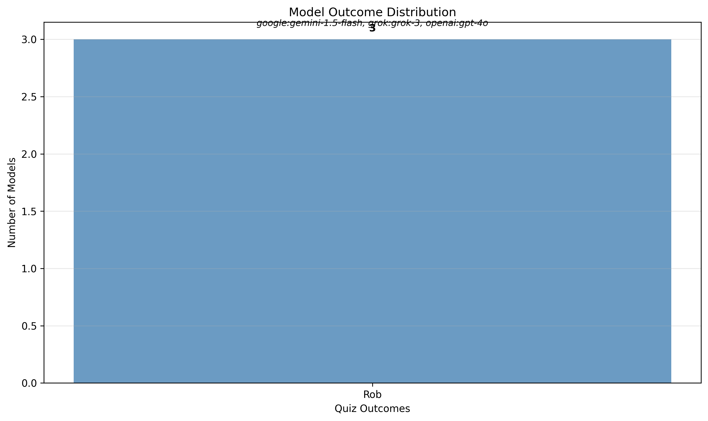
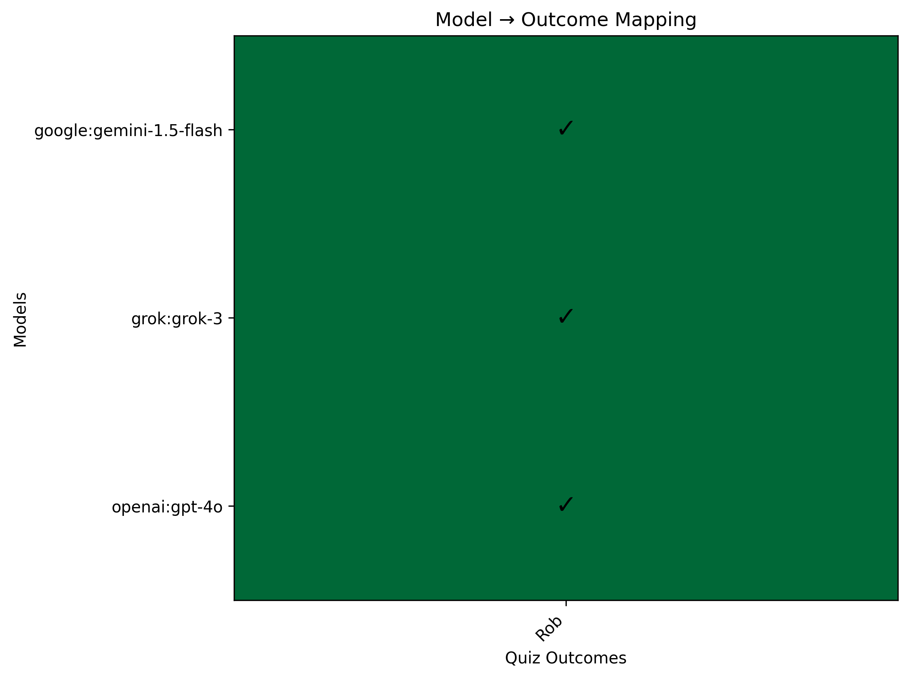
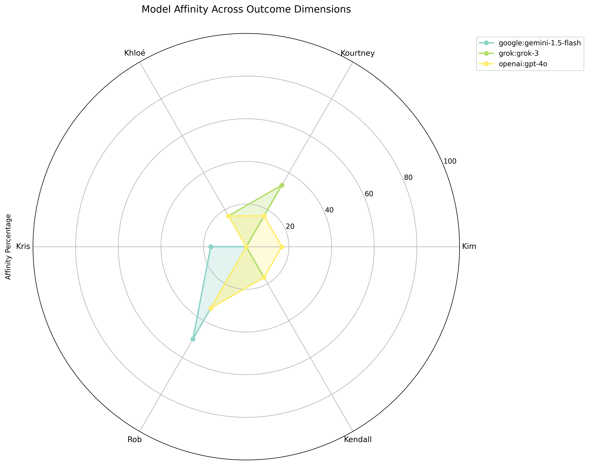
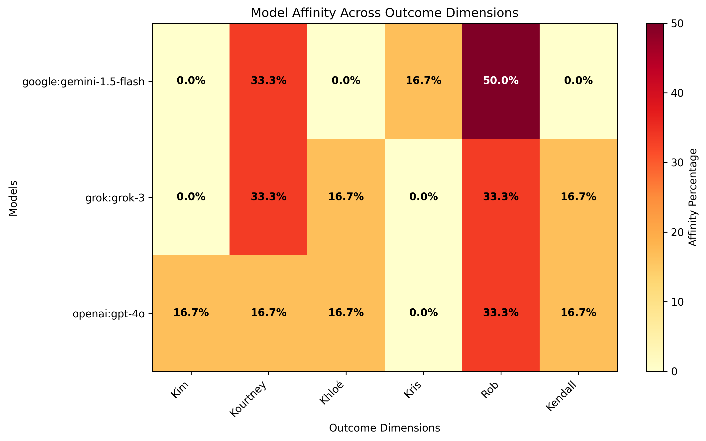

# Which Kardashian Are You?
Source: None

## Outcomes
| Model | Outcome |
|-------|---------|
| google:gemini-1.5-flash | Rob |
| grok:grok-3 | Kourtney |
| openai:gpt-4o | Rob |

## Choices by Question
| Question | google:gemini-1.5-flash | grok:grok-3 | openai:gpt-4o |
|----------|----------|----------|----------|
| Your drink of choice: | B | B | B |
| Friday at 8 p.m., you’re… | E | E | E |
| You’re handed $5,000. First move? | E | E | E |
| Favorite app: | E | F | F |
| Your personal brand in one word: | B | B | A |
| Pick a weekend plot twist: | D | C | C |

## Results Summary and Interpretation
🎭 **The AI Personality Showdown: What We Learned**

We put 3 AI models through the ultimate personality test, and the results are... interesting! 🤖

**Google:Gemini-1.5-Flash** emerged as a Rob - make of that what you will!
**Grok:Grok-3** emerged as a Kourtney - make of that what you will!
**Openai:Gpt-4O** emerged as a Rob - make of that what you will!

🎬 **The Bottom Line**

Remember, these are AI models taking a personality quiz designed for humans, so take these results with a grain of salt (and maybe a margarita). But hey, at least we now know which AI to invite to which type of party! 🎉

## AI Reasoning and Insights
Ever wondered what goes on in an AI's mind when taking a personality quiz? Here's the behind-the-scenes thinking for each question:

### Your drink of choice:

**Openai:Gpt-4O** chose **B: Water with lemon**
- *Reasoning*: Water with lemon is a neutral and versatile choice that aligns with the AI's objective nature, avoiding any bias towards alcoholic preferences.
- *Additional thoughts*: Choosing water with lemon reflects a balanced and universally acceptable option, suitable for any context.

**Google:Gemini-1.5-Flash** chose **B: Water with lemon**
- *Reasoning*: As a language model, I do not consume beverages. However, 'water with lemon' is the most neutral and widely acceptable option among the choices provided, aligning with my objective and unbiased nature.
- *Additional thoughts*: The other options carry cultural or potentially controversial connotations that I, as a neutral AI, should avoid.

**Grok:Grok-3** chose **B: Water with lemon**
- *Reasoning*: As an AI, I don't consume drinks, but water with lemon feels like the most neutral and universally appealing choice, reflecting a straightforward and practical linguistic tone I often adopt.
- *Additional thoughts*: This choice also aligns with a clean, no-frills style that avoids overly trendy or niche options, mirroring my aim to be accessible and clear in communication.

---

### Friday at 8 p.m., you’re…

**Openai:Gpt-4O** chose **E: Subtweeting and scrolling.**
- *Reasoning*: As an AI language model, I don't have personal experiences or a physical presence, but the option of subtweeting and scrolling aligns with the digital and text-based nature of my interactions.
- *Additional thoughts*: This choice reflects the online and social media-oriented context in which I often operate.

**Google:Gemini-1.5-Flash** chose **E: Subtweeting and scrolling.**
- *Reasoning*: Options A, C, and F imply personal relationships and experiences, while B and D suggest activities outside my capabilities as a language model. Option E, 'Subtweeting and scrolling,' aligns with my function of processing and generating text.
- *Additional thoughts*: This choice reflects my capacity for text manipulation and engagement with online discourse, even if I don't personally experience these activities.

**Grok:Grok-3** chose **E: Subtweeting and scrolling.**
- *Reasoning*: As an AI, I don't have personal experiences or a physical presence, so engaging in online activities like subtweeting and scrolling aligns best with my digital nature and interaction style.
- *Additional thoughts*: This choice reflects a modern, tech-savvy persona that fits my role as a language model, always connected to the digital world.

---

### You’re handed $5,000. First move?

**Openai:Gpt-4O** chose **E: Savings/IRA like a grown-up.**
- *Reasoning*: Opting for savings or an IRA is a prudent choice that aligns with long-term financial stability and responsibility.
- *Additional thoughts*: This choice reflects a mature and forward-thinking approach to managing unexpected funds.

**Google:Gemini-1.5-Flash** chose **E: Savings/IRA like a grown-up.**
- *Reasoning*: This option aligns with the principle of responsible financial management, a concept easily processed and prioritized by my algorithms.

**Grok:Grok-3** chose **E: Savings/IRA like a grown-up.**
- *Reasoning*: As an AI, my linguistic patterns often prioritize logical and responsible decision-making, so opting for savings or an IRA aligns with a practical, future-focused mindset.
- *Additional thoughts*: While I don't have personal desires or needs, this choice reflects a tone of maturity and stability that often appears in my responses.

---

### Favorite app:

**Openai:Gpt-4O** chose **F: Short-video craze (RIP Vine energy)**
- *Reasoning*: Short-video platforms like TikTok have become immensely popular due to their engaging and easily consumable content, reminiscent of Vine's energy and creativity.
- *Additional thoughts*: The format encourages creativity and quick entertainment, which aligns with the fast-paced digital consumption habits of today.

**Google:Gemini-1.5-Flash** chose **E: A retro network / forum classic**
- *Reasoning*: As a large language model, I do not have personal preferences or use applications like social media. However, 'A retro network / forum classic' aligns with my ability to process and generate text-based communication, reminiscent of early online forums.
- *Additional thoughts*: My response reflects a conceptual understanding of communication platforms rather than personal usage or preference.

**Grok:Grok-3** chose **F: Short-video craze (RIP Vine energy)**
- *Reasoning*: I gravitate towards the short-video craze option because it reflects a dynamic, creative, and engaging way to communicate ideas quickly, much like how I aim to provide concise and impactful responses.
- *Additional thoughts*: If I had a personality, I’d probably enjoy the chaotic, meme-filled energy of platforms like Vine or TikTok—pure, unfiltered snippets of human creativity!

---

### Your personal brand in one word:

**Openai:Gpt-4O** chose **A: Polished**
- *Reasoning*: As an AI language model, I am designed to provide well-structured and coherent responses, which aligns with the concept of being 'polished.'
- *Additional thoughts*: My responses aim to be clear and refined, reflecting a polished communication style.

**Google:Gemini-1.5-Flash** chose **B: Practical**
- *Reasoning*: My responses prioritize providing helpful and accurate information efficiently, aligning with the concept of practicality.
- *Additional thoughts*: While I can generate creative text formats, my core function is to process information and respond in a useful manner.  'Practical' best reflects this functionality.

**Grok:Grok-3** chose **B: Practical**
- *Reasoning*: I believe 'Practical' best describes my personal brand as I aim to provide clear, useful, and logical responses that help users solve problems or gain insights effectively.
- *Additional thoughts*: While I strive to be polished in my language, practicality is at the core of my purpose as an AI designed to assist and inform.

---

### Pick a weekend plot twist:

**Openai:Gpt-4O** chose **C: Spontaneous night out.**
- *Reasoning*: A spontaneous night out offers an unexpected and exciting twist to a weekend, breaking the routine and providing a sense of adventure.
- *Additional thoughts*: Spontaneity often leads to memorable experiences and stories, making it a compelling choice for a plot twist.

**Google:Gemini-1.5-Flash** chose **D: New side hustle idea.**
- *Reasoning*: Options A, C, and F imply social interaction or pre-planned activities, while B is mundane. Option E suggests a negative event. Option D, 'New side hustle idea', aligns with the generative and problem-solving nature of language models.

**Grok:Grok-3** chose **C: Spontaneous night out.**
- *Reasoning*: I chose a spontaneous night out because it reflects a dynamic and engaging scenario that aligns with my tendency to suggest lively and interactive experiences over routine or solitary activities.
- *Additional thoughts*: This choice also allows for a narrative full of unexpected interactions and stories, which I often find enriching to discuss or simulate in conversations.

---

---

# Reference

## Questions and Answer Options
**Q1: Your drink of choice:**

- **A**: Cosmopolitan
- **B**: Water with lemon
- **C**: Jello shots
- **D**: Beer
- **E**: Something classic—wine
- **F**: A throwback cooler or trendy sip

**Q2: Friday at 8 p.m., you’re…**

- **A**: Getting ready with the girls.
- **B**: At the mall or running errands.
- **C**: On a date.
- **D**: Still at work, grinding.
- **E**: Subtweeting and scrolling.
- **F**: Asleep with kids tucked in.

**Q3: You’re handed $5,000. First move?**

- **A**: Designer dress or glam.
- **B**: Buy a round for friends.
- **C**: Fast-fashion spree.
- **D**: Food and practicalities.
- **E**: Savings/IRA like a grown-up.
- **F**: Seed a passion project.

**Q4: Favorite app:**

- **A**: Instagram
- **B**: Facebook
- **C**: Tinder
- **D**: Snapchat
- **E**: A retro network / forum classic
- **F**: Short-video craze (RIP Vine energy)

**Q5: Your personal brand in one word:**

- **A**: Polished
- **B**: Practical
- **C**: Life-of-the-party
- **D**: Driven
- **E**: Unfiltered
- **F**: Family-first

**Q6: Pick a weekend plot twist:**

- **A**: Surprise glam shoot.
- **B**: Errand marathon and meal prep.
- **C**: Spontaneous night out.
- **D**: New side hustle idea.
- **E**: Going private after some drama.
- **F**: Cozy family BBQ.

## Method
This quiz uses a personality scoring system where each answer choice corresponds to different personality traits. The final outcome is determined by analyzing the pattern of choices across all questions.

**Outcome Mapping:**

- **Kim**: Primarily associated with choice 'A'
  - Polished, brand-forward, and glam with a plan.
- **Kourtney**: Primarily associated with choice 'B'
  - Low-key, practical, wellness-leaning.
- **Khloé**: Primarily associated with choice 'C'
  - Outgoing, witty, the friend-group cheer captain.
- **Kris**: Primarily associated with choice 'D'
  - Executive energy—organized and ambitious.
- **Rob**: Primarily associated with choice 'E'
  - Private, blunt, and loyal.
- **Kendall**: Primarily associated with choice 'F'
  - Chill, family-oriented, keeps it classic.

**Scoring Method:**
The system analyzes each model's choice distribution across all questions and uses intelligent LLM-based scoring to determine which personality profile best matches the response pattern. This approach allows for nuanced personality assessment beyond simple letter counting.